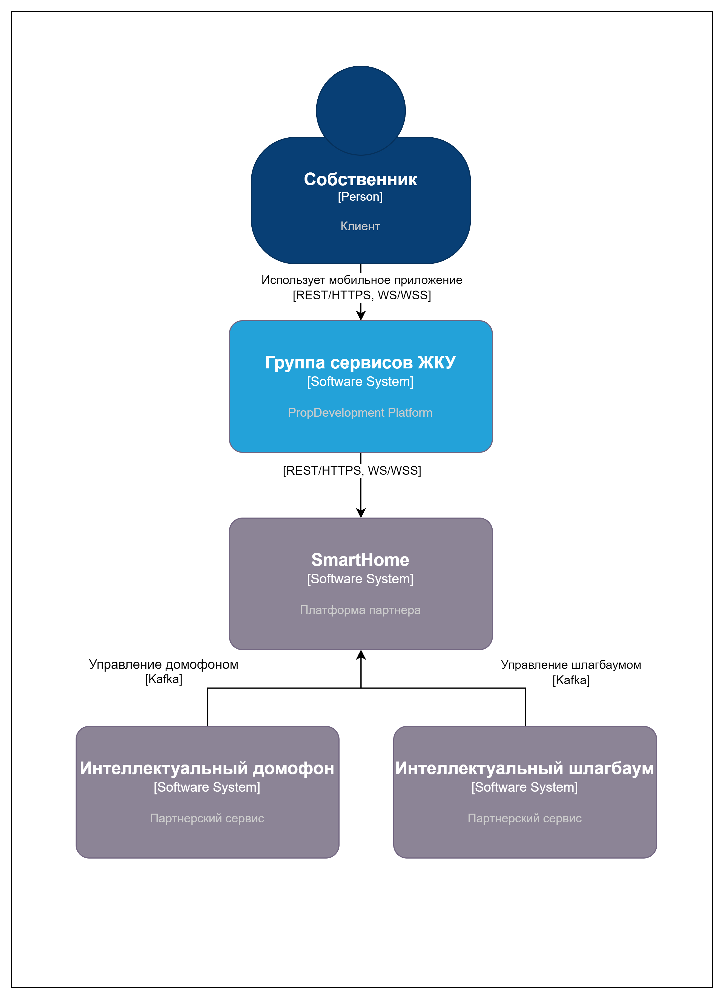

# Диаграмма контекста в модели С4

# Диаграмма контейнеров PropDevelopment

## Требования к безопасности

- Пользователи должны проходить аутентификацию через auth-service-1
- JWT Auth токены ограниченны по времени
- TLS и mTLS
- Ограничения для токенов к сервисам по принципу минимальных привилегий
- Соблюдение требований ФЗ-152 для обработки данных
- Обезличивание данных для аналитики и отчетности 

